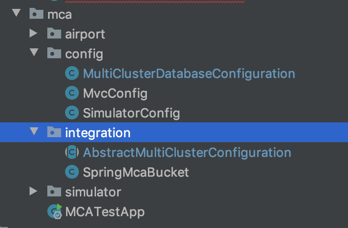

#  Multi Cluster Awareness Java SDK and Springboot Integration


# Scope

# Content

0. [0. Pre-requisites](#0.)
1. [1. Quick Start](#1.)
3. [2. Springboot Integration](#3.)
5. [5. Failure vs Failover](#5.)
6. [6. Build and run](#6.)
6. [7. Test Failure Scenarios](#7.)

## 0. Pre-Requesites

* [Setup Couchbase Server Cluster](docs/couchbase-setup.md)
	* Create a demo bucket with a `user`/`password` user privileges.


	
	
* Install [Maven](https://maven.apache.org/)

* Latest Couchbase MCA Java SDK (currectly version 1.25)

```
    <repositories>
        <repository>
            <id>cb-ee</id>
            <name>Couchbase EE Repo</name>
            <url>https://subscription.couchbase.com/maven2</url>
        </repository>
    </repositories>
    
    <dependencies>
        <dependency>
            <groupId>com.couchbase.client</groupId>
            <artifactId>multi-cluster-java</artifactId>
            <version>1.2.5</version>
           <exclusions>
                <exclusion>
                    <groupId>com.couchbase.client</groupId>
                    <artifactId>java-client</artifactId>
                </exclusion>
            </exclusions>
        </dependency>
        
        ...
        
    </dependencies>  
```

	
* Couchbase Java Client SDK 2.x (+2.13 version)

``` 
        <dependency>
            <groupId>com.couchbase.client</groupId>
            <artifactId>java-client</artifactId>
            <version>2.7.13</version>
        </dependency> 
```

* Springboot libraries (2.2.2.RELEASE)

```
    <parent>
        <groupId>org.springframework.boot</groupId>
        <artifactId>spring-boot-starter-parent</artifactId>
        <version>2.2.2.RELEASE</version>
        <relativePath/> <!-- lookup parent from repository -->
    </parent>
```

* Couchbase Reactive Spring data 

``` 
        <dependency>
            <groupId>org.springframework.boot</groupId>
            <artifactId>spring-boot-starter-data-couchbase-reactive</artifactId>
            <exclusions>
                <exclusion>
                    <groupId>com.couchbase.client</groupId>
                    <artifactId>java-client</artifactId>
                </exclusion>
            </exclusions>
        </dependency>
```
	

## 1. Quick Start

* Setup your connection clusters bootstrap:

*application.properties*

```
# Configure your Cluster bootstrap nodes 
## List of nodes comma separated. At least (replica number + 1) nodes here 
mca.couchbase.bootstrap-hosts=MyClusterA;10.0.0.1,10.0.0.2 MyClusterB;10.0.1.1,10.0.1.2

# default bucket
mca.couchbase.bucket.name=demo
mca.couchbase.username=user
mca.couchbase.password=password

...

```

* **Start the application**

```
mvn spring-boot:run
```


Open [http://localhost:8080](http://localhost:8080) in your favorite browser and start the app simulator for emulate writing/reading/querying operations using MCA SDK. It will attempt to connect to the first cluster given into the cluster list. 


## 2. Couchbase MultiCluster Awareness SDK

As an advanced NoSQL Database, Couchbase has built in features for replication across multiple data centers. In these kinds of deployments, it is most common for application servers to be co-located with each cluster. This way the SDK can work with a given cluster to handle topology changes, failures, etc.

However, there is also a need in some deployments to have an application server work in conjunction with multiple clusters which are using Couchbase’s built in XDCR replication. In these deployments there is a careful alignment of cluster replication behavior to application behavior and application failover behavior.

This library exists for those circumstances. 


## 3. Springboot Integration

This project demostrates the integration of the Java MCA library with spring / spring boot.

The "glue" code is found under the internal package, but the rest under the main com.couchbase.spring.mca is just application level code that can be customized.



The code demos how to use both the template and the repository to perform operations which are backed by the underlying MCA library. Coordinator and failure detector can (and should) be customized in the MultiClusterDatabaseConfiguration class.


```
@Configuration
public class MultiClusterDatabaseConfiguration extends AbstractMultiClusterConfiguration {

    @Value("${mca.couchbase.bootstrap-hosts}")
    private String bootstrap;
    @Value("${mca.couchbase.username:Administrator}")
    private String userName;
    @Value("${mca.couchbase.bucket.name:demo}")
    private String bucketName;
    @Value("${mca.couchbase.password:password}")
    private String userPass;
    @Value("${mca.couchbase.minFailureNodes:1}")
    private int minFailureNodes;

    @Bean
    @Override
    public String bucketName() {
       return bucketName;
    }

    @Bean
    @Override
    public String userName() {
        return userName;
    }

    @Bean
    @Override
    public String userPass() {
       return userPass;
    }


    private ClusterSpec from(String clusterSpec) {
        String []values = clusterSpec.split(";");
        return ClusterSpec.create(Stream.of(values[1].split(",")).collect(toSet()),values[0]);
    }


    public List<ClusterSpec> clustersList() {
        return Stream.of(bootstrap.split(" ")).map(this::from).collect(Collectors.toList());
    }


    @Bean
    @Override
    public Coordinator coordinator() {
        return Coordinators.isolated(new IsolatedCoordinator.Options()
                .clusterSpecs(clustersList())
                .activeEntries(1)
                .failoverNumNodes(this.minFailureNodes)
                .serviceTypes(new HashSet<>(Arrays.asList(ServiceType.BINARY, ServiceType.QUERY)))
        );

    }

    @Bean
    public FailureDetectorFactory<? extends FailureDetector> failureDetectorFactory() {
        return FailureDetectors.nodeHealth(coordinator(), NodeHealthFailureDetector.options().minFailedNodes(this.minFailureNodes)); 
    }


}
```


## 4. Failover vs Failure 

-- TBD --


## 5. Sample Test Failure Scenarios


### 5.1. Sample Architecture Overview


**Cluster A** with `demo` bucket `replica 1`

|Node|Services|
|:--|:--|
| 10.0.0.1 | Query, Index |
| 10.0.0.2 | Query, Index |
| 10.0.0.3 | Data |
| 10.0.0.4 | Data |
| 10.0.0.5 | Data |

**Cluster B** with `demo` bucket `replica 1`

|Node|Services|
|:--|:--|
| 10.0.1.1 | Query, Index |
| 10.0.1.2 | Query, Index |
| 10.0.1.3 | Data |
| 10.0.1.4 | Data |
| 10.0.1.5 | Data |


### 5.2. Test Cases

#### Disabled Auto-failover Test Cases

| Cluster Scenario | Data Nodes Status | Query Service Status | desired mca action |
|:--|:--|:--|:--|
| All nodes UP & Running  | Running | Running | Health Cluster - stay same cluster - no changes |
| 1 data node failure |  Down | Down *cannot provide data* | **switch** to another healthy cluster |
| 1 Query node failure | Running | Running | Increase failure Counter, stay same cluster |
| 1 Query node down and 1 Data Node failure | Down | Down | **switch** to another healthy cluster |
| 2 Query nodes down | Running | Down | **switch** to another healthy cluster |
 
* **One** failure in **data** service nodes triggers the switchover to another cluster.
* **Two** failures in **query** service nodes triggers the switchover to another cluster.

 
#### Enabled Auto-failover Test Cases

| Cluster Scenario | Data Nodes Status | Query Service Status | desired mca action |
|:--|:--|:--|:--|
| All nodes UP & Running  | Running | Running | Health Cluster - stay same cluster - no changes |
| 1 data node **failover** | Running | Running | **Autofailover** scenario - stay same cluster |
| 1 data node **failover** and 1 data node **failure** | Down | Down | **switchover** to another cluster |
| 1 Query nodes failure | Running | Running | Increase Query failure Counter, stay same cluster |
| 2 Query nodes down | Running | Down | **switchover** to another healthy cluster |
| 1 Query node failure and 1 data node **failover** | Running | Running | Data autofailover, increases Query failure Counter, stay same cluster |
 
* First data failure is considered as **Auto-failover** and doesn't increase the failures counters
* **One** failure in **data** service nodes triggers the switchover to another cluster.
* **Two** failures in **query** service nodes triggers the switchover to another cluster.


### 5.3. NodeHealthFailureDetector Configuration


*application.properties*

```
...


mca.couchbase.minFailureNodes=1

...

```

```
@Configuration
public class MultiClusterDatabaseConfiguration extends AbstractMultiClusterConfiguration {
    ... 
     
    @Bean
    public FailureDetectorFactory<? extends FailureDetector> failureDetectorFactory() {
        return FailureDetectors.nodeHealth(coordinator(), NodeHealthFailureDetector.options().minFailedNodes(this.minFailureNodes));
    }

```


# Appendix

Template for failures tests scenarios:

**Cluster Configuration**

|Node|Services|
|:--|:--|
| | |
| | |
| | |
| | |
| | |

**Clusters Events**

| # | Timestamp | Event | Node | Expected Action | Observed Action |MCA Reaction Timestamp |   
| :-- | :-- | :-- | :-- | :-- | :-- | :-- |
| | | | | | | | | 

